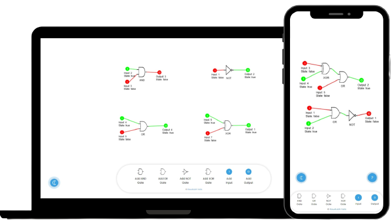

# Logix - Logic Gate Circuit Simulator [](https://wakatime.com/badge/user/49a4b5a3-8d9f-4ff9-95dc-67e32d20f8b4/project/7daaeec3-4d62-44cc-b164-a742f5d8f1d8)
Logix is a web-based logic gate circuit simulator that allows users to design and simulate digital logic circuits. It provides an intuitive interface for creating circuits using various logic gates and visualizing the circuit's behavior in real-time.



### Live link
[https://logicx.netlify.app/](https://logicx.netlify.app/)

## Features

- **Circuit Design:** Easily create logic circuits by adding gates, inputs, and outputs on a virtual canvas using drag-and-drop functionality.
- **Real-time Simulation:** Observe the circuit's behavior instantly as you change the input states, enabling interactive experimentation.
- **Support for Multiple Gate Types:** Logix supports a wide range of logic gates, including AND, OR, NOT, XOR, and more, allowing for the creation of complex circuits.
- **Zoom and Pan:** Zoom in and out, as well as pan across the canvas, to inspect circuit details or get an overview of the entire circuit.
- **Educational Tool:** Logix serves as an educational resource for learning digital logic design principles and experimenting with circuitry concepts.

## Getting Started

To get started with Logix, follow these steps:

1. Clone the repository:

   ```shell
   git clone https://github.com/your-username/logix.git
    ```

2. Navigate to the project directory and install the dependencies:

    ```shell
    cd logix
    npm install
    ```

3. Start the development server:

    ```shell
    npm start
    ```

4. Open Logix in your web browser at ```http://localhost:3000```.

## Contributions
Contributions to Logix are welcome! If you encounter any issues or have suggestions for improvements, please open an issue or submit a pull request.

## Contact
For any inquiries or feedback, please contact [Kaustubh Vats](https://kaustubhvats-portfolio.netlify.app).

Feel free to customize the content further to fit your project's specific details and requirements.
Let me know if there's anything else I can assist you with!